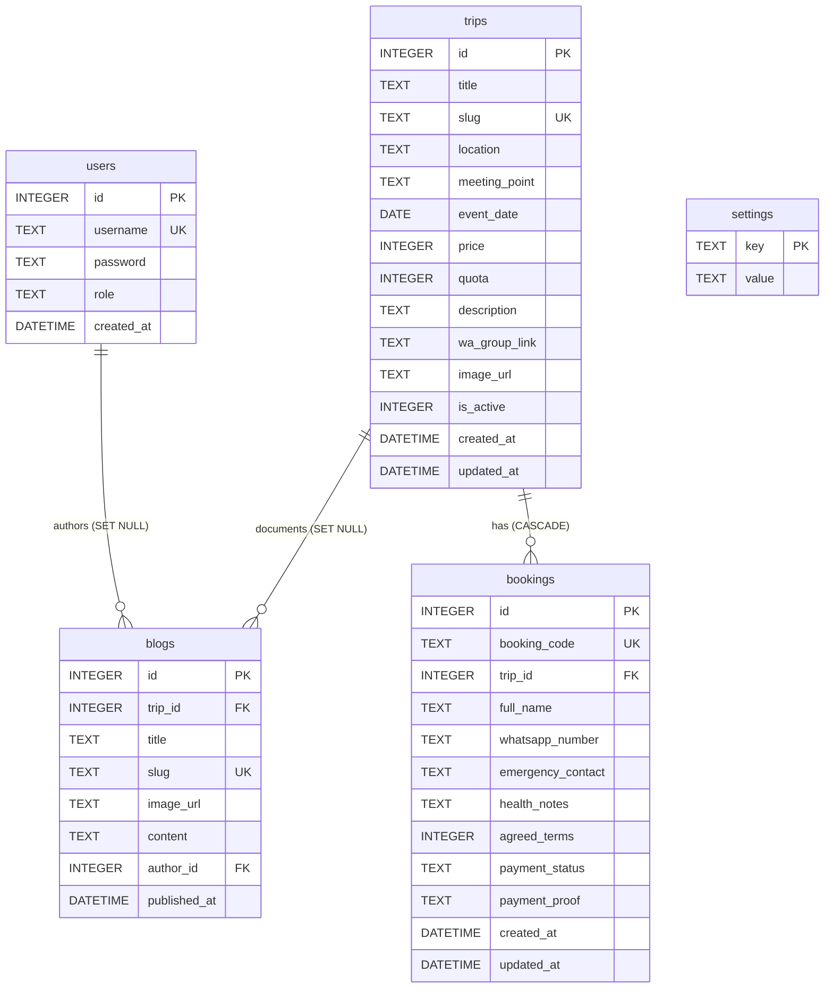

# Hiking App - Web Booking & Admin Management

A lightweight, modern web application designed for organizing outdoor activities, silent hiking trips, and nature experiences. Built with Node.js (Express) and SQLite for robust data management, featuring a public booking portal, dynamic bank settings, and an admin management dashboard.

---

## Features

### Public Features
- **Trip Exploration & Thumbnails**: View upcoming hiking events with dedicated thumbnail photos, trip details, separate Destination and Meeting Point locations, remaining quota, and pricing.
- **Dynamic Bank Instructions**: Real-time display of active bank account/e-wallet transfer information dynamically fetched from the database upon booking submission.
- **Easy Booking System**: Seamless registration with validation, emergency contact collection, health notes, and terms agreement.
- **Payment Proof Upload**: Submit transfer receipts for admin review and approval.
- **Interactive Experience**: Built-in 1-minute guided breath exercise simulator, ambient forest sound generator, and downloadable digital intention pass.
- **Clean URLs**: Clean routing setup (`/admin`, `/login`) without `.html` file extensions.
- **Blog & Documentation (Dummy/Work-in-Progress)**: Section for hiking guides and trip recaps.

### Admin Dashboard
- **Trip Management**: Create, edit, and toggle activation status for hiking trips, upload customized thumbnail images via Multer, and set maximum participant quota.
- **Dynamic Bank Account Settings**: Manage and update payment account details (Bank Name, Account Number, and Account Holder Name) in real-time with live badge preview.
- **Interactive WhatsApp Approval (`wa.me`)**: 
  - Approve or reject participant payments.
  - Clicking **Approve** automatically updates payment status to `APPROVED` and opens a pre-formatted WhatsApp message (`https://wa.me/62...`) containing participant name, booking code, trip batch, event date, destination, meeting point, and WhatsApp group link.
- **Phone Number Normalization**: Automatically converts and normalizes phone numbers (e.g., `08xxx` to `628xxx`) to ensure seamless `wa.me` links.
- **Role-Based Access Control**: Protected admin endpoints using JWT (JSON Web Token) authentication and `bcryptjs` password hashing.

---

## Database Architecture

The application uses an **SQLite** database (`better-sqlite3`) with relational integrity, foreign key constraints, and indexing for optimized queries.

### Entity-Relationship Diagram (ERD)



### Table Schema Summary

1. **`users`**: Stores admin authentication credentials and roles (`admin`, `superadmin`).
2. **`trips`**: Manages event details, location, meeting point, dates, pricing, quota, image thumbnails, and WhatsApp group links.
3. **`bookings`**: Records participant entries, contact numbers in international `62` format, payment status (`PENDING`, `APPROVED`, `REJECTED`), and payment proof uploads.
4. **`settings`**: Dynamic key-value table for system configurations (Bank Name, Account Number, Account Holder).
5. **`blogs`**: Contains articles, trip recaps, and photos (Dummy / Extended feature).

---

## Getting Started

### 1. Database Initialization

Execute the SQL initialization script to create tables, indexes, and default seed data:

```bash
sqlite3 database.sqlite < schema.sql

```

Alternatively, run the raw SQL query directly inside your database client or backend initialization script:

```sql
PRAGMA foreign_keys = ON;

-- 1. USERS TABLE
CREATE TABLE IF NOT EXISTS users (
    id INTEGER PRIMARY KEY AUTOINCREMENT,
    username TEXT NOT NULL UNIQUE,
    password TEXT NOT NULL,
    role TEXT CHECK(role IN ('admin', 'superadmin')) DEFAULT 'admin',
    created_at DATETIME DEFAULT CURRENT_TIMESTAMP
);

-- 2. TRIPS TABLE
CREATE TABLE IF NOT EXISTS trips (
    id INTEGER PRIMARY KEY AUTOINCREMENT,
    title TEXT NOT NULL,
    slug TEXT NOT NULL UNIQUE,
    location TEXT NOT NULL,
    meeting_point TEXT,
    event_date DATE NOT NULL,
    price INTEGER NOT NULL CHECK(price >= 0),
    quota INTEGER NOT NULL CHECK(quota > 0),
    description TEXT,
    wa_group_link TEXT,
    image_url TEXT,
    is_active INTEGER NOT NULL DEFAULT 1 CHECK(is_active IN (0, 1)),
    created_at DATETIME DEFAULT CURRENT_TIMESTAMP,
    updated_at DATETIME DEFAULT CURRENT_TIMESTAMP
);

-- 3. BOOKINGS TABLE
CREATE TABLE IF NOT EXISTS bookings (
    id INTEGER PRIMARY KEY AUTOINCREMENT,
    booking_code TEXT NOT NULL UNIQUE,
    trip_id INTEGER NOT NULL,
    full_name TEXT NOT NULL,
    whatsapp_number TEXT NOT NULL,
    emergency_contact TEXT NOT NULL,
    health_notes TEXT,
    agreed_terms INTEGER NOT NULL CHECK(agreed_terms = 1),
    payment_status TEXT NOT NULL DEFAULT 'PENDING' CHECK(payment_status IN ('PENDING', 'APPROVED', 'REJECTED')),
    payment_proof TEXT,
    created_at DATETIME DEFAULT CURRENT_TIMESTAMP,
    updated_at DATETIME DEFAULT CURRENT_TIMESTAMP,
    FOREIGN KEY (trip_id) REFERENCES trips(id) ON DELETE CASCADE
);

-- 4. SETTINGS TABLE
CREATE TABLE IF NOT EXISTS settings (
    key TEXT PRIMARY KEY,
    value TEXT NOT NULL
);

-- 5. BLOGS TABLE (Dummy / Extended)
CREATE TABLE IF NOT EXISTS blogs (
    id INTEGER PRIMARY KEY AUTOINCREMENT,
    trip_id INTEGER,
    title TEXT NOT NULL,
    slug TEXT NOT NULL UNIQUE,
    image_url TEXT NOT NULL,
    content TEXT NOT NULL,
    author_id INTEGER,
    published_at DATETIME DEFAULT CURRENT_TIMESTAMP,
    FOREIGN KEY (trip_id) REFERENCES trips(id) ON DELETE SET NULL,
    FOREIGN KEY (author_id) REFERENCES users(id) ON DELETE SET NULL
);

-- INDEXING
CREATE INDEX IF NOT EXISTS idx_trips_is_active ON trips(is_active);
CREATE INDEX IF NOT EXISTS idx_bookings_trip_id ON bookings(trip_id);
CREATE INDEX IF NOT EXISTS idx_bookings_status ON bookings(payment_status);
CREATE INDEX IF NOT EXISTS idx_bookings_code ON bookings(booking_code);

-- DEFAULT SEED DATA
INSERT OR IGNORE INTO settings (key, value) VALUES 
('bank_name', 'BCA'),
('account_number', '1234567890'),
('account_holder', 'Silent Hiking Indonesia');

```

---

## Default Credentials

After database seeding, a default admin account is populated:

* **Username**: `admin`
* **Default Role**: `superadmin`

> **Security Warning**: Ensure to update default credentials and secret keys before deploying to production.

---

## License

This project is open-source and available under the [MIT License](LICENSE).